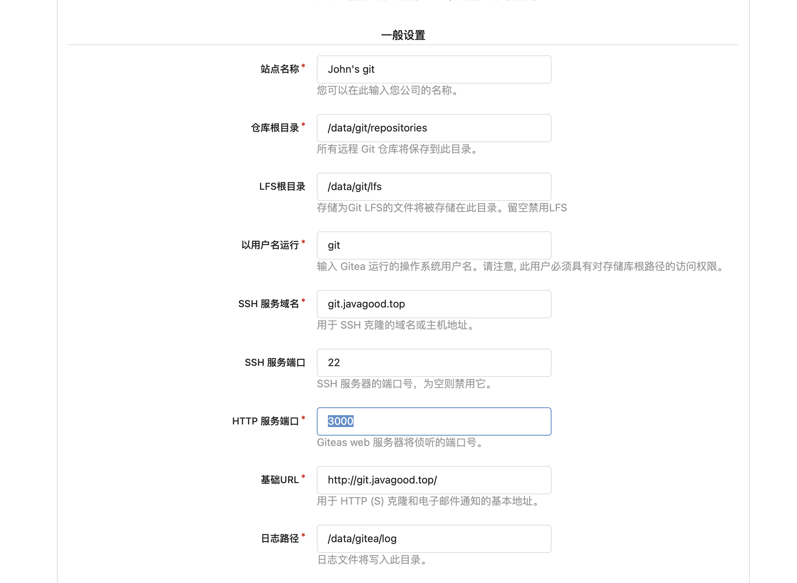

# raspberry pi for linux

# 已使用的端口 
``` 
mariaDB 3306 
ddns 9876 
portainer 9443 8000 
cloudreve 5212 
tomcat 8080 
erp 8888 
netdata 19999
gitea 2022 3000

```
---
# 系统

## 开启root登陆
```
sudo passwd root
sudo passwd --unlock root
sudo sed -i "s/^#PermitRootLogin.*/PermitRootLogin yes/g" /etc/ssh/sshd_config
sudo systemctl restart ssh
sudo cp ~/.bashrc /root/.bashrc
```

## 树莓派
### <kbd>ubuntu18.04</kbd>镜像下载[点击这里](https://mirrors.tuna.tsinghua.edu.cn/ubuntu-cdimage/ubuntu/releases/18.04/release/ubuntu-18.04.5-preinstalled-server-arm64%2Braspi4.img.xz)
### 更新系统镜像（ubuntu18.04）
```
echo "deb http://mirrors.tuna.tsinghua.edu.cn/ubuntu-ports/ bionic main restricted universe multiverse
deb http://mirrors.tuna.tsinghua.edu.cn/ubuntu-ports/ bionic-updates main restricted universe multiverse
deb http://mirrors.tuna.tsinghua.edu.cn/ubuntu-ports/ bionic-backports main restricted universe multiverse
deb http://mirrors.tuna.tsinghua.edu.cn/ubuntu-ports/ bionic-security main restricted universe multiverse" > /etc/apt/sources.list
```

## 设置定时重启
```
crontab -e
```
添加命令（每天4点定时重启）：
```
0 4 * * *  sudo reboot
```
保存并退出。查看当前定时任务：
```
crontab -l
```

---
# python3
## pip3
```
sudo apt install python3-pip
cd /etc
vim pip.conf  
```
```
[global]
index-url = https://pypi.tuna.tsinghua.edu.cn/simple
```

---
# java
```
  sudo apt-get install openjdk-11-jdk -y
```

---
# tomcat
```
  sudo apt-get install tomcat8 -y
  service tomcat8 start
```
---

# mariaDB
```
sudo apt-get install mariadb-server -y
```
```
sudo mysql
use mysql; 
UPDATE user SET password=password('密码') WHERE user='root'; 
UPDATE user SET plugin='mysql_native_password' WHERE user = 'root'; 
flush privileges; 
exit;
```
```
sudo systemctl restart mariadb 
```

## 远程访问
```
vim /etc/mysql/mariadb.conf.d/50-server.cnf
注释掉127.0.0.1
```
```
mysql -u root -p 
GRANT ALL PRIVILEGES ON *.* TO 'root'@'%' IDENTIFIED BY '密码' WITH GRANT OPTION;
GRANT ALL PRIVILEGES ON *.* TO 'user'@'remoteip' IDENTIFIED BY '密码' WITH GRANT OPTION;
FLUSH PRIVILEGES;
exit;
```
```
service mysql restart
```

## 导出sql文件
```
mysqldump -u root -p 0520erp > 0520erp.sql
```

## 导入sql
```
登录mysql
create database 数据库名;
source /XXX/xx.sql
```

---
# nginx配置
[点击这里](nginx.md)

---

# 安装nodejs
```
mkdir /software/node
wget https://npmmirror.com/mirrors/node/v16.13.2/node-v16.13.2-linux-arm64.tar.xz
tar -xf node-v16.13.2-linux-arm64.tar.xz
```
```
vim /etc/profile
```
添加如下内容：
```
export NODE_HOME=/software/node/node-v16.13.2-linux-arm64
export PATH=$PATH:$NODE_HOME/bin
```
```
source /etc/profile
```
验证安装是否成功：
```
node -v
npm -v
```
安装cnpm
```
sudo npm install -g cnpm --registry=https://registry.npmmirror.com
```
---
# docker

## 安装docker
```
sudo curl -fsSL https://get.docker.com | sh
```

## 启动Docker
```
systemctl start docker
```

## 查看docker启动状态
```
systemctl status docker
```

## 查看启动中的容器
```
docker ps
```

## 设置开机自启动
```
systemctl enable docker.service
```

## 查看docker开机启动状态 enabled:开启, disabled:关闭
```
systemctl is-enabled docker.service
```


## docker更换国内镜像源
```
https://cr.console.aliyun.com/cn-hangzhou/instances/mirrors
```
```
sudo vim /etc/docker/daemon.json
{
 "registry-mirrors": ["https://mim2fpma.mirror.aliyuncs.com"]
}
sudo systemctl daemon-reload
sudo systemctl restart docker
```

---

## docker安装ddns-go
```
docker pull jeessy/ddns-go
```
```
docker run -d --name ddns-go --restart=always --net=host jeessy/ddns-go
```

## docker安装cloudreve
```
docker pull xavierniu/cloudreve
```
```
docker run -d --name cloudreve -e PUID=0 -e PGID=0 -e TZ="Asia/Shanghai" -p 5212:5212 --restart=unless-stopped -v /software/cloudreve/sharedfolders:/cloudreve/uploads -v /software/cloudreve/dockercnf/cloudreve/config:/cloudreve/config -v /software/cloudreve/dockercnf/cloudreve/db:/cloudreve/db -v /software/cloudreve/dockercnf/cloudreve/avatar:/cloudreve/avatar  xavierniu/cloudreve
```
首次启动后请执行 
```
docker logs -f cloudreve
```
获取初始密码；

## docker安装portainer
```
docker pull portainer/portainer-ce
```
```
docker run -d -p 8000:8000 -p 9000:9000 -p 9443:9443 \
    --name=portainer --restart=always \
    -v /var/run/docker.sock:/var/run/docker.sock \
    -v portainer_data:/data \
    portainer/portainer-ce:latest
```


## docker安装netdata
```
https://learn.netdata.cloud/docs/get-started#run-netdata-with-docker
```
```
docker run -d --name=netdata \
  -p 19999:19999 \
  -v netdataconfig:/etc/netdata \
  -v netdatalib:/var/lib/netdata \
  -v netdatacache:/var/cache/netdata \
  -v /etc/passwd:/host/etc/passwd:ro \
  -v /etc/group:/host/etc/group:ro \
  -v /proc:/host/proc:ro \
  -v /sys:/host/sys:ro \
  -v /etc/os-release:/host/etc/os-release:ro \
  --restart unless-stopped \
  --cap-add SYS_PTRACE \
  --security-opt apparmor=unconfined \
  netdata/netdata
```

## docker安装java
```
docker pull java
```

## docker安装python
```
docker pull python
```

## docker安装gitea
```
docker run -d --privileged=true --restart=always --name=gitea -p 2022:22 -p 3000:3000 -v /software/gitea:/data gitea/gitea:latest
```
具体配置如下：


## docker安装青龙面板并配置京豆
[点击这里](ql.md)

## 安装docker-compose
```
  sudo apt-get install docker-compose -y
```

## docker 安装mariaDB
```
docker run --name mariadb -p 3306:3306 -e MYSQL_ROOT_PASSWORD=123456 -v /data/mariadb/data:/var/lib/mysql --restart always -d mariadb
```

## docker 安装mongoDB
```
mkdir /software/mongodb
chmod 777 /software/mongodb

docker run -di --name mongodb --privileged --restart always -p 27017:27017 \
-v /software/mongodb/data/db:/data/db \
-v /software/mongodb/conf:/data/configdb \
-v /software/mongodb/log:/data/log \
mongo
```

## docker安装code-server
```
docker run -d --name coder-server -p 28080:8080 -e PASSWORD=123 --restart always codercom/code-server:latest
```
---
## 一键安装命令

完整版：

```
wget https://gitee.com/hahaju/setup_linux/raw/master/setup.sh && chmod 755 setup.sh && ./setup.sh all && rm setup.sh && reboot
```

精简版：

```
wget https://gitee.com/hahaju/setup_linux/raw/master/setup.sh && chmod 755 setup.sh && ./setup.sh lite && rm setup.sh && reboot
```

## 安装内容

### 完整版：

- [x] pip
- [x] java
- [x] tomcat
- [x] docker
- [x] docker-compose
- [x] ddns-go(docker)
- [x] cloudreve(docker)
- [x] portainer(docker)
- [x] code-server(docker)

### 精简版：

- [x] pip
- [x] java
- [x] tomcat
- [x] docker
- [x] docker-compose
